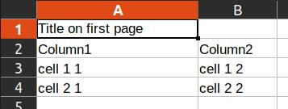

# Reporter-JDK1.8

Simple package aimed to write SQL database to resource. Available output formats:

html, pdf<font size=2><sup id="a1">[1](#f1)</sup></font>, xls, xlsx, doc<font size=2><sup id="a2">[2](#f2)</sup></font>,
docx, csv
\
\
Use as lib: add folder "Reporter-JDK1.8" to your project.\
Use as service: ... (in development)

|       Dependencies       |              Usage              |
|:------------------------:|:-------------------------------:|
|   org.springframework    |                                 |
| org.springframework.boot |                                 |
|       com.itextpdf       |               pdf               |
|      org.apache.poi      |         xls, xlsx, docx         |
|     com.documents4j      |               doc               |
|     net.sf.supercsv      |               csv               |
|        org.slf4j         |             logging             |
|     com.google.guava     |           toString()            |
|   org.codehaus.groovy    | groovy scripts <br/>remote call |

Documentation in progress.

## Example

```java
public class ReporterApplication {
    public void Test() {
        //Document will be saved in a new file "Document name.xlsx"
        final Document doc =
            Document.create()
                .setLabel("Document name")
                .addParts(
                    Title.create("Title on first page"),
                    Table.create(
                            TableHeaderRow.create(
                                TableHeaderCell.create("Column1"),
                                TableHeaderCell.create("Column2")
                            )
                        )
                        .addParts(
                            TableRow.create(
                                TableCell.create("cell 1 1"),
                                TableCell.create("cell 1 2")
                            ),
                            TableRow.create(
                                TableCell.create("cell 2 1"),
                                TableCell.create("cell 2 2")
                            )
                        )
                );
        //Creating appropriate formatter
        final XlsxFormatter xlsxFormatter = XlsxFormatter.create();
        //DocumentHolder as AutoCloseable will hold our file "Document name.xlsx"
        try (DocumentHolder documentHolder = xlsxFormatter.handle(doc)) {
            final File file = documentHolder.getResource().getFile();
            //Any stuff with file here
        } catch (Throwable ignore) {

        }
    }
}
```

produces


Let's adjust cell width for our Title:

```java
public class ReporterApplication {
    public void Test() {
        final Title title =
            Title.create("Title on first page")
                .setStyle(
                    LayoutStyle.create()
                        .setAutoWidth(true)
                );

    }

}
```



Now let's add text style to table row cells:

```java
public class ReporterApplication {
    public void Test() {
        Table.create(
                TableHeaderRow.create(
                    TableHeaderCell.create("Column1"),
                    TableHeaderCell.create("Column2")
                )
            )
            .addParts(
                TableRow.create(
                    TableCell.create("cell 1 1"),
                    TableCell.create("cell 1 2")
                ),
                TableRow.create(
                    TableCell.create("cell 2 1"),
                    TableCell.create("cell 2 2")
                )
            )
            .spreadStyleToParts(                         //spreading style to table rows and their cells
                TextStyle.create("Times New Roman")
                    .setBold(true)
                    .setItalic(true)
                    .setUnderline((byte) 1)
                    .setFontSize((short) 15)
                    .setColor(Color.GREY)
            );

    }
}
```


We can put Document to HtmlFormatter:

```java
import com.model.formatter.DocumentHolder;

public class ReporterApplication {
    public void Test() {
        final HtmlFormatter htmlFormatter = HtmlFormatter.create();
        try (DocumentHolder documentHolder = htmlFormatter.handle(doc)) {
            final File file = documentHolder.getResource().getFile();
        } catch (Throwable ignored) {
        }

    }
}
```


Styles are written in each html-element because we assign them directly to elements through
setStyle() or spreadStyleToParts(). It is convenient when using html4 specification.
But in html5 using [StyleService](src/main/java/com/model/domain/style/StyleService.java)
styles can be written in header section with unique indexes. For more details see the examples below.

Ok, seems we need some table borders:

```java
public class ReporterApplication {
    public void Test() {
        final LayoutStyle bordersStyle = LayoutStyle.create()
            .setBorderTop(BorderStyle.create(Color.RED, BorderWeight.MEDIUM))
            .setBorderLeft(BorderStyle.create(Color.RED, BorderWeight.MEDIUM))
            .setBorderRight(BorderStyle.create(Color.RED, BorderWeight.MEDIUM))
            .setBorderBottom(BorderStyle.create(Color.RED, BorderWeight.MEDIUM));

        final Table table = Table.create(
                TableHeaderRow.create(
                        TableHeaderCell.create("Column1"),
                        TableHeaderCell.create("Column2")
                    )
                    .spreadStyleToParts(bordersStyle)
            )
            .addParts()
            .spreadStyleToParts(
                LayoutTextStyle.create(
                    TextStyle.create("Times New Roman")
                        .setBold(true)
                        .setItalic(true)
                        .setUnderline((byte) 1)
                        .setFontSize((short) 15)
                        .setColor(Color.GREY),
                    bordersStyle
                )
            );
    }
}
```


Same result, but using StyleService:
<details>
  <summary>Code</summary>

```java
import com.model.formatter.DocumentHolder;

public class ReporterApplication {
    public void Test() {
        final LayoutStyle titleStyle =
            LayoutStyle.create()
                .setAutoWidth(true)
                .setCondition(StyleCondition.create(Title.class));

        final LayoutStyle bordersStyle =
            LayoutStyle.create()
                .setBorderTop(BorderStyle.create(Color.RED, BorderWeight.MEDIUM))
                .setBorderLeft(BorderStyle.create(Color.RED, BorderWeight.MEDIUM))
                .setBorderRight(BorderStyle.create(Color.RED, BorderWeight.MEDIUM))
                .setBorderBottom(BorderStyle.create(Color.RED, BorderWeight.MEDIUM))
                .setCondition(StyleCondition.create(TableHeaderCell.class));

        final LayoutTextStyle commonCellsStyle =
            LayoutTextStyle.create(
                    TextStyle.create("Times New Roman")
                        .setBold(true)
                        .setItalic(true)
                        .setUnderline((byte) 1)
                        .setFontSize((short) 15)
                        .setColor(Color.GREY),
                    bordersStyle.clone().setCondition(null)
                )
                .setCondition(StyleCondition.create(TableCell.class));

        final HtmlStyleService styleService =
            HtmlStyleService.create()
                .addStyles(titleStyle, bordersStyle, commonCellsStyle);

        doc =
            Document.create()
                .setLabel("Document name")
                .addParts(
                    Title.create("Title on first page"),
                    Table.create(
                            TableHeaderRow.create(
                                TableHeaderCell.create("Column1"),
                                TableHeaderCell.create("Column2")
                            )
                        )
                        .addParts(
                            TableRow.create(
                                TableCell.create("cell 1 1"),
                                TableCell.create("cell 1 2")
                            ),
                            TableRow.create(
                                TableCell.create("cell 2 1"),
                                TableCell.create("cell 2 2")
                            )
                        )
                );

        final HtmlFormatter htmlFormatter = HtmlFormatter.create().setStyleService(styleService);

        try (DocumentHolder documentHolder = htmlFormatter.handle(doc)) {
            final File file = documentHolder.getResource().getFile();
        } catch (Throwable ignored) {

        }
    }
}
```

</details>
<br/>


If you need a single "collapsed" frame around all columns
<details>
   <summary>Code</summary>

```java
public class ReporterApplication {
    public void testTable() throws CloneNotSupportedException {
        final LayoutStyle titleStyle =
            LayoutStyle.create()
                .setAutoWidth(true)
                .setCondition(StyleCondition.create(Title.class));

        final LayoutTextStyle headerCellsStyle =
            LayoutTextStyle.create(
                TextStyle.create("Times New Roman")
                    .setBold(true)
                    .setItalic(true)
                    .setUnderline((byte) 1)
                    .setFontSize((short) 15)
                    .setColor(Color.BLUE),
                LayoutStyle.create()
                    .setBorderTop(BorderStyle.create(Color.RED, BorderWeight.DOUBLE))
                    .setBorderLeft(BorderStyle.create(Color.RED, BorderWeight.DOUBLE))
                    .setBorderRight(BorderStyle.create(Color.RED, BorderWeight.DOUBLE))
                    .setBorderBottom(BorderStyle.create(Color.RED, BorderWeight.DOUBLE))
                    .setFillBackgroundColor(Color.ORANGE)
            );

        final LayoutTextStyle commonCellsStyle =
            LayoutTextStyle.create(
                TextStyle.create(),
                LayoutStyle.create()
                    .setBorderTop(BorderStyle.create(Color.BLACK, BorderWeight.THIN))
                    .setBorderLeft(BorderStyle.create(Color.BLACK, BorderWeight.THIN))
                    .setBorderRight(BorderStyle.create(Color.BLACK, BorderWeight.THIN))
                    .setBorderBottom(BorderStyle.create(Color.BLACK, BorderWeight.THIN))
                    .setFillBackgroundColor(Color.YELLOW)
            ).setCondition(StyleCondition.create(TableCell.class));

        final HtmlStyleService styleService = HtmlStyleService.create()
            .setHtmlColgroupTag(HtmlColgroupTag.create().setEnabled(true))
            .addStyles(titleStyle, commonCellsStyle);

        doc =
            Document.create()
                .setLabel("Document name")
                .addParts(
                    Title.create("Title on first page"),
                    Table.create(
                            TableHeaderRow.create(
                                    TableHeaderCell.create("Column1"),
                                    TableHeaderCell.create("Column2")
                                )
                                .spreadStyleToParts(headerCellsStyle)
                        )
                        .addParts(
                            TableRow.create(
                                TableCell.create("cell 1 1"),
                                TableCell.create("cell 1 2")
                            ),
                            TableRow.create(
                                TableCell.create("cell 2 1"),
                                TableCell.create("cell 2 2")
                            )
                        )
                );

        final HtmlFormatter htmlFormatter = HtmlFormatter.create().setStyleService(styleService);

        try (DocumentHolder documentHolder = htmlFormatter.handle(doc)) {
            final File file = documentHolder.getResource().getFile();
        } catch (Throwable ignored) {

        }
    }
}
```

</details>


Little example on how to get data from DB:

```java
import com.model.formatter.DocumentHolder;

public class ReporterApplication {
    public void Test() {
        final NamedParameterJdbcTemplate jdbcTemplate;          //connection to db
        // columns traffic_name_as_in_db, traffic_dir_as_in_db are present in DB
        final TableHeaderCell th1 =
            TableHeaderCell.create("Traffic name").setAliasName("traffic_name_as_in_db");

        final TableHeaderCell th2 =
            TableHeaderCell.create("Traffic direction").setAliasName("traffic_dir_as_in_db");

        final Document html =
            Document.create()
                .setLabel("doc.html")
                .addParts(
                    QueryTable.create(TableHeaderRow.create(th1, th2))
                        .setNamedParameterJdbcTemplate(jdbcTemplate)
                );
        //Creating appropriate formatter
        final HtmlFormatter htmlFormatter = HtmlFormatter.create();
        //DocumentHolder as AutoCloseable will be holding our file "doc.html"
        try (DocumentHolder documentHolder = htmlFormatter.handle(doc)) {
            final File file = documentHolder.getResource().getFile();
            //Any stuff with file here
        } catch (Throwable ignored) {

        }
    }
}
```

The names of the columns in DB must be known in advance or flag isTableHeaderRowFromData
of [QueryTable](src/main/java/com/model/domain/db/QueryTable.java)
or [ReportTable](src/main/java/com/model/domain/ReportTable.java) must be set.

For more examples see [tests](src/test/java/com/reporter/TutorialTest.java).

What reporter can't do yet:

1) Render any nested elements in any elements (for example table in table cell not available now)

#### Inner structure

[  ](pic/classes.jpg)

## Contributing

Pull requests are welcome. For major changes, please open an issue first to discuss what you would like to change.

Please make sure to update tests as appropriate.

## License

[MIT](https://choosealicense.com/licenses/mit/)

###### Footnotes:

<b id="f1"><font size=2><sup style="color:Tomato;">1</sup></font></b>[↩](#a1)
when exporting texts with different languages to pdf format, try to use different fonts:

1) Add appropriate .ttf file to [free_fonts](src/main/resources/free_fonts)
   folder and set it to text style as below:

```java
import com.model.formatter.DocumentHolder;

public class ReporterApplication {
    public void Test() {
        //read all fonts and available locales from resources
        final FontService fontService = FontService.create()
            .initializeFonts();

        final TextStyle textStyleZH = TextStyle.create()
            //set font name 
            .setFontNameResource("xiaolai_Monospaced_(en-zh).ttf")
            //set fontFamily class
            .setFontFamilyStyle(FontFamilyStyle.MONOSPACED)
            //optionally set font locale    
            .setFontLocale("zh");


        final Document doc = Document
            .create()
            .addParts(
                Title.create("一些文字").setStyle(textStyle1)
            );

        //Create appropriate formatter
        final PdfFormatter pdfFormatter = PdfFormatter.create()
            .getStyleService()
            //Set fontService here
            .setFontService(fontService);
        //DocumentHolder as AutoCloseable will be holding our file "doc.pdf"
        try (DocumentHolder documentHolder = pdfFormatter.handle(doc)) {
            final File file = documentHolder.getResource().getFile();
            //Any stuff with file here
        } catch (Throwable ignored) {

        }
    }
}
```

The font file name should contain
[FontFamilyStyle](src/main/java/com/model/domain/style/FontFamilyStyle.java) name
embracing in "_", like file names in [free_fonts](src/main/resources/free_fonts) folder

2) Add language (necessary) and its alphabet (optionally) to
   [free_fonts/alphabets.properties](src/main/resources/free_fonts/alphabets.properties), for instance:

```java
pl=aąbcćdeęfghijklłmnńoópqrsśtuvwxyzźż
    zh=
```

<b id="f2"><font size=2><sup style="color:Tomato;">2</sup></font></b>[↩](#a2)
.doc file retrieves from .docx through local or remote [documents4j](https://documents4j.com)
converters:
<font size=2>
> The MS Word converter is represented by a MicrosoftWordBridge instance. This bridge starts MS Word when the connected
> LocalConverter is started and quits Word once the local converter is shut down. Note that this implies that only a
> single
> active LocalConverter instance must exist not only for a JVM but for the entire physical machine. Otherwise, MS Word
> might be shut down by one bridge while it is still required by another instance. This cannot be controlled by
> documents4j but must be assured by its user. Also, make sure not to use MS Word outside a Java application while a
> MicrosoftWordBridge is active, for example by opening it from your desktop.
</font>
